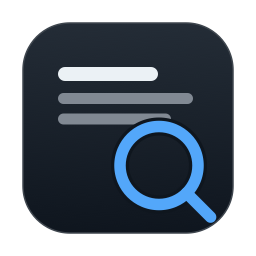
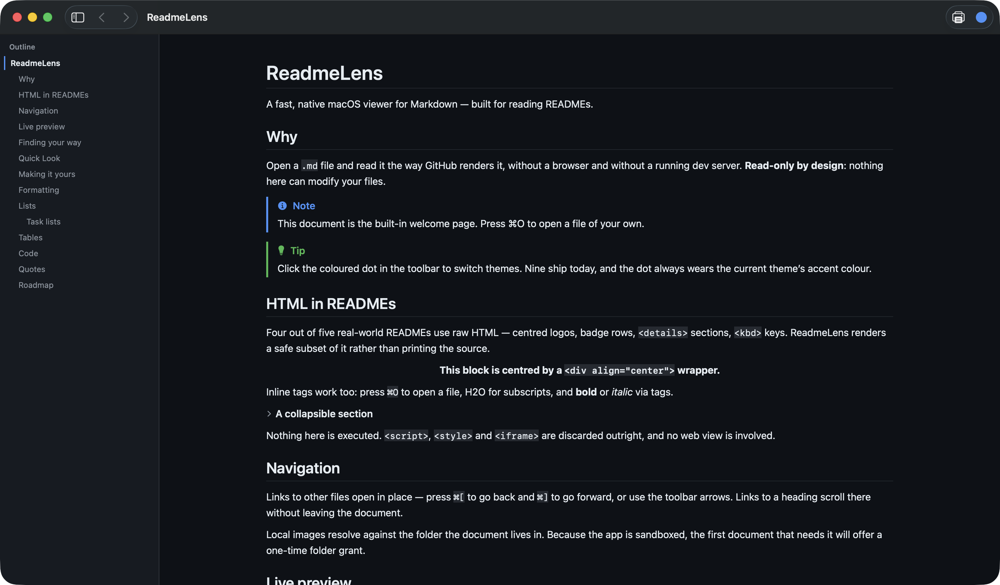
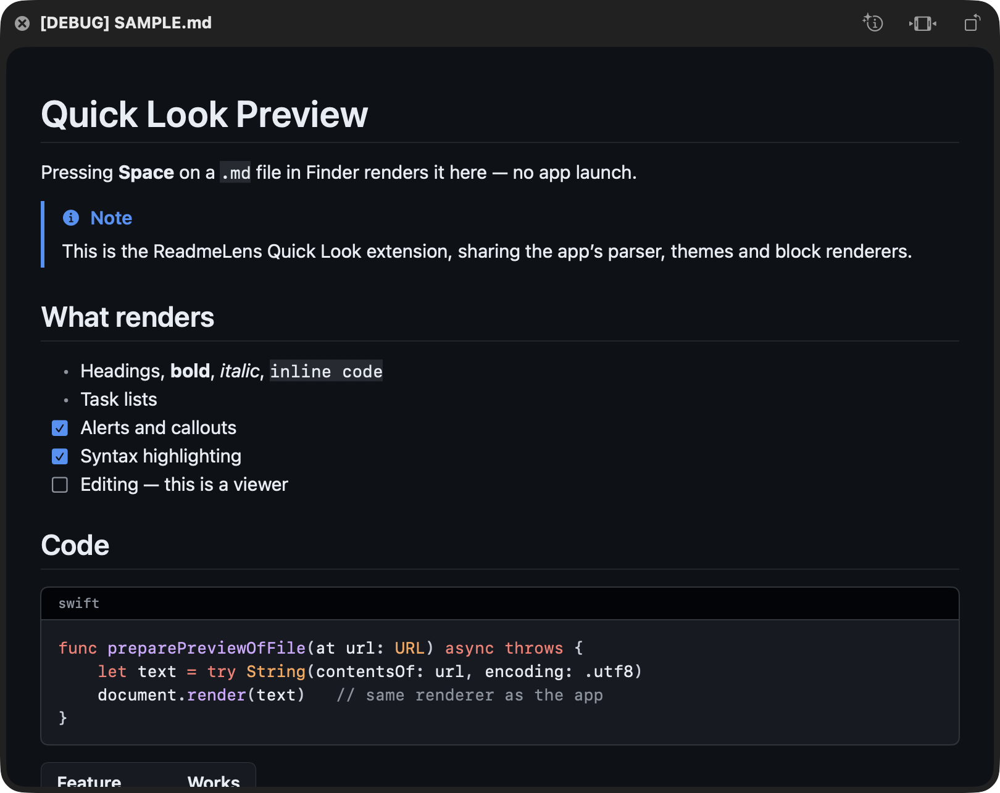
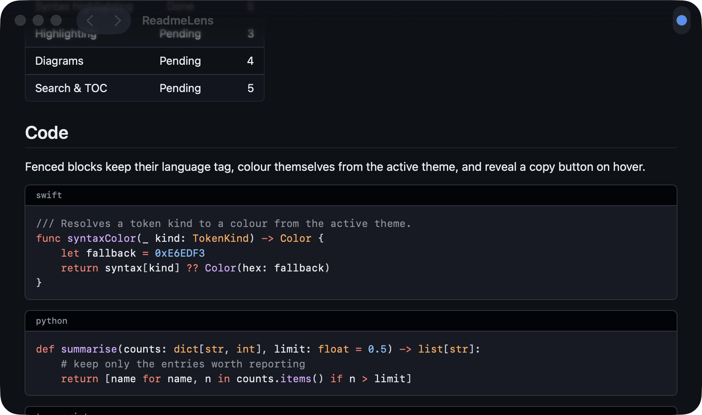
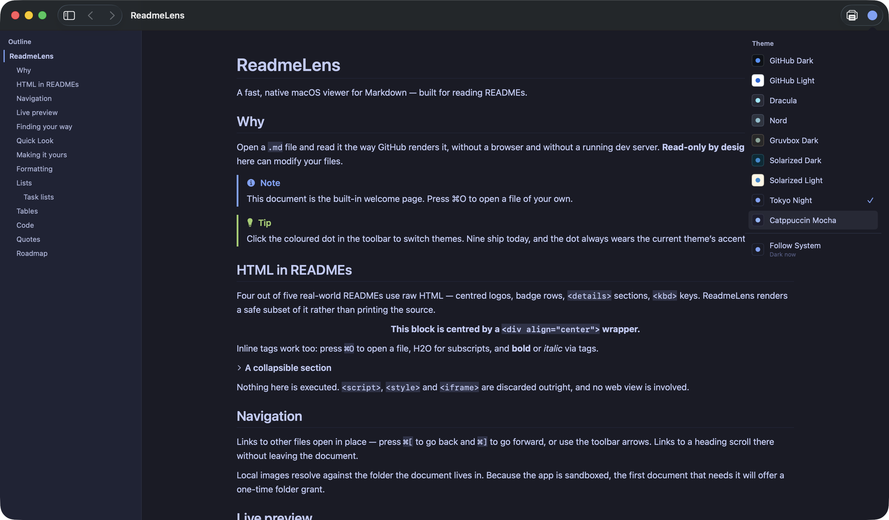
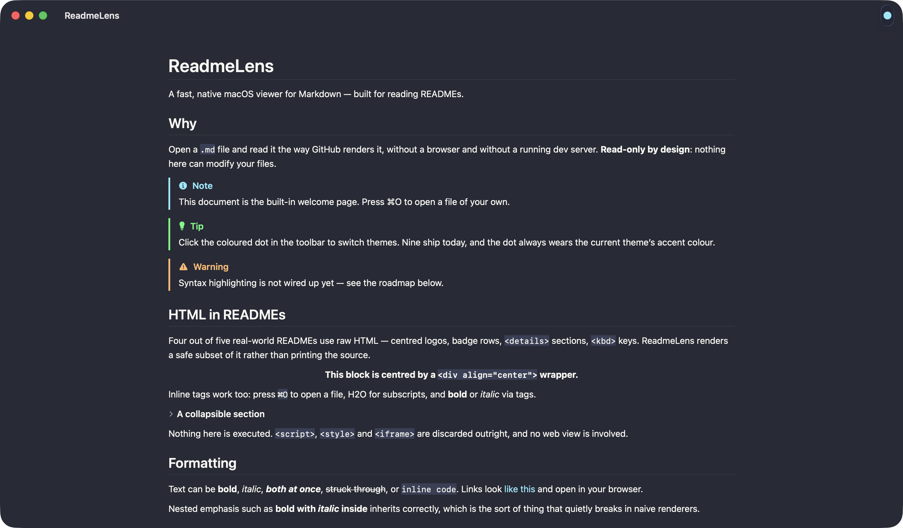
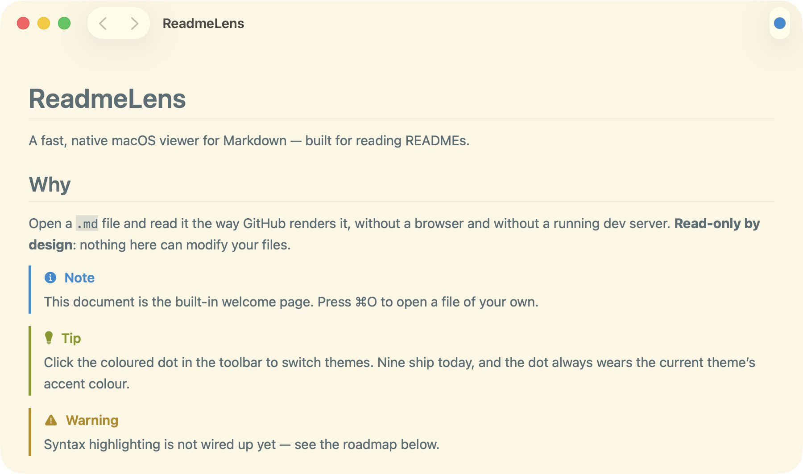

<div align="center">



# ReadmeLens

**A fast, native macOS viewer for Markdown — built for reading READMEs.**

Open a `.md` file and read it the way GitHub renders it. No browser, no dev
server, no Electron.

[](https://github.com/SolankiYogesh/ReadmeLens/actions/workflows/ci.yml)
[](https://github.com/SolankiYogesh/ReadmeLens/releases/latest)
[](https://github.com/SolankiYogesh/ReadmeLens/releases)
[](https://www.apple.com/macos/)
[](https://swift.org)
[](LICENSE)



</div>

---

## Why

Most Markdown previewers either ship a whole browser engine or render something
that looks nothing like GitHub. ReadmeLens is a small native app that does one
job properly.

> **Read-only by design.** ReadmeLens opens and renders files. It has no editor
> and no write entitlement — it *cannot* modify your files. Even PDF export goes
> through the system print panel, so the print system does the writing, not the
> app.

- **Native and small.** SwiftUI + AppKit, a ~5 MB app, instant cold start.
- **GitHub-accurate.** Alerts, task lists, table alignment, heading rules — and
  the raw HTML that four out of five real READMEs depend on.
- **Yours to adjust.** Type sizes, column width, zoom, reading mode, and custom
  themes loaded from a folder.
- **Quick Look.** Press Space on any `.md` in Finder and it renders there,
  without launching the app.
- **Outline and search.** A heading sidebar that tracks where you are, and
  find-in-document that highlights matches in place.
- **Live preview.** Save in your editor and the view refreshes in place,
  keeping your position in the document.
- **Syntax highlighting** for ~20 languages, coloured by the active theme.
- **Nine themes**, switchable from a single dot in the toolbar.
- **Private.** No network calls, no analytics, no telemetry.

## Settings and custom themes

`⌘,` opens Settings: theme, body and code sizes, column width, zoom and reading
mode, with a live preview of the type.

Custom themes are JSON files in a folder the Settings pane will reveal. Drop one
in and it appears in the picker immediately — the folder is watched. **Export
Current Theme as JSON** writes a complete file to edit from, and a theme that
fails to load is reported by file, field and value rather than silently ignored.

A minimal theme needs only five keys; everything else is derived:

```json
{
  "id": "midnight",
  "name": "Midnight",
  "appearance": "dark",
  "canvas": "#0A0E14",
  "foreground": "#B3B1AD",
  "accent": "#39BAE6"
}
```

A complete example is in [docs/example-theme.json](docs/example-theme.json).

## Printing and PDF

`⌘P` prints. The print panel's **PDF ▸ Save as PDF** is how you get a PDF file —
routing it that way means the print system does the writing and the app keeps
its read-only sandbox.

There is a printer button in the toolbar next to the theme dot, as well as `⌘P`.

Dark themes print on a light ground; printing a dark canvas wastes ink and reads
badly on paper.

A sandboxed app needs `com.apple.security.print` to print at all — without it
macOS refuses with its own "this application does not support printing" alert.
That entitlement covers printing only; file access remains read-only.

Code blocks and tables scroll horizontally on screen; on paper they lay out
plainly and long code lines wrap, since a page cannot scroll. Syntax
highlighting is resolved synchronously for printing, because a render pass runs
no async work.

One known limitation: pages are sliced at a fixed height, so a line of text can
be cut across a page break. Making pagination block-aware is the fix, and it is
not done.

## Quick Look



Select a `.md` file in Finder and press **Space**. The extension lives inside
the app bundle and shares its parser, themes, syntax highlighter and block
renderers — so a preview looks exactly like the app, minus the chrome.

It follows the *system* appearance rather than the theme selected in the app: an
extension runs in its own sandbox container and cannot read the host app's
preferences. Sharing them would need an App Group, which in turn needs a real
signing team.

## Outline and search

The sidebar lists every heading — including ones inside centred `<div>` headers
and `<details>` sections — and marks the section you are currently reading, not
merely the heading you last clicked. Indentation reflects the heading levels a
document actually uses, so a README that starts at `##` is not pushed to the
right for no reason.

`⌘F` searches headings, paragraphs and code blocks. Matches are highlighted
where they sit, with the current one picked out more brightly, and `⌘G` steps
through them. A match inside a list item or quote scrolls to the block that
contains it, since nested content is not addressable on its own.

## Several documents at once

Select a handful of `.md` files in Finder and open them together, drop them on
the window, or pick several in `⌘O`. They open in **one window** as a single
trail, and the toolbar arrows walk it — with a **2 of 5** counter so you know
where you are.

Finder sometimes delivers a multi-file selection as one event and sometimes as
several in quick succession; both end up as the same single trail.

Following a link inside a document appends to the same trail, so the arrows
always mean one thing rather than being link-only history that stays disabled
until you happen to click a link. As in a browser, following a link partway
through replaces whatever was ahead.

## Live preview

Leave ReadmeLens open beside your editor: saving refreshes the view in place and
keeps your reading position, with a brief **Updated** badge to confirm.

Most editors save by writing a temporary file and renaming it over the original,
which replaces the file's inode — a watcher holding the original descriptor
would go deaf after the first save. ReadmeLens re-arms on the *path*, so
repeated saves keep working. Events from one save are debounced into a single
reparse.

Toggle it with `⇧⌘R`.

## Syntax highlighting



Around twenty languages are recognised: Swift, JavaScript/TypeScript (and JSX),
Python, Go, Rust, Java, Kotlin, C/C++/C#, PHP, Ruby, Dart, Scala, shell, SQL,
JSON, YAML/TOML, CSS/SCSS and HTML/XML.

The highlighter emits *token kinds* — keyword, string, comment, function, type
— and the theme maps those to colours. That is why every theme colours code
correctly without the highlighter knowing any of them exist. An unrecognised
language tag renders plain rather than guessing.

Tokenising runs off the main thread and results are cached, so scrolling past a
long block does not re-tokenise it.

## Themes

Click the coloured dot in the toolbar to open the palette. The dot always wears
the current theme's accent colour, so you can tell your theme at a glance.

| | |
|:--:|:--:|
| **Tokyo Night** | **Dracula** |
|  |  |
| **Solarized Light** | **GitHub Dark** |
|  |  |

Also bundled: **GitHub Light**, **Nord**, **Gruvbox Dark**, **Solarized Dark**
and **Catppuccin Mocha** — plus **Follow System**, which swaps between your
chosen light and dark pairing as macOS changes appearance.

## Install

### Download

Grab the latest `.zip` from the
[**Releases**](https://github.com/SolankiYogesh/ReadmeLens/releases/latest)
page, unarchive it, and drag **ReadmeLens.app** into `/Applications`.

Builds are ad-hoc signed rather than notarised, so macOS blocks them on first
launch. Right-click the app and choose **Open**, then confirm — or clear the
quarantine flag:

```bash
xattr -dr com.apple.quarantine /Applications/ReadmeLens.app
```

### Make it the default Markdown viewer

On first launch ReadmeLens offers to take over `.md` files. You can also do it
any time from **File ▸ Open Markdown Files with ReadmeLens…**, or from Finder's
Get Info panel.

macOS only assigns defaults to *installed* apps, so move ReadmeLens to
`/Applications` first. If you set it while running from a build folder it will
work, but the association points at a path that disappears when that folder is
cleaned — the app says so rather than letting you find out later.

Only Markdown types are claimed. `.txt` is deliberately left alone.

### Build from source

Requires **Xcode 15+** and **macOS 14+**.

```bash
git clone https://github.com/SolankiYogesh/ReadmeLens.git
cd ReadmeLens

brew install xcodegen     # once
xcodegen generate
open ReadmeLens.xcodeproj # then press ⌘R
```

Or straight from the command line:

```bash
xcodebuild -project ReadmeLens.xcodeproj -scheme ReadmeLens build
xcodebuild -project ReadmeLens.xcodeproj -scheme ReadmeLens \
  -destination 'platform=macOS' test
```

The app icon is generated rather than committed as opaque bitmaps — edit
`Tools/GenerateAppIcon.swift` and re-run it to change the artwork:

```bash
swift Tools/GenerateAppIcon.swift Resources/Assets.xcassets/AppIcon.appiconset
```

## Usage

| Action | How |
|:--|:--|
| Preview without opening | Select a `.md` in Finder, press `Space` |
| Open files | `⌘O`, drop them on the window, or select them in Finder |
| Move between open documents | The toolbar arrows, or `⌘[` / `⌘]` |
| Open from a terminal | `open -a ReadmeLens README.md` |
| Follow a link to another file | Click it — it opens in place |
| Jump to a heading | Click any `#anchor` link |
| Find in document | `⌘F`, then `⌘G` / `⇧⌘G` to step through matches |
| Toggle the outline | `⌥⌘S` |
| Settings | `⌘,` |
| Zoom | `⌘+` / `⌘−` / `⌘0` |
| Reading mode | `⌥⌘R` |
| Print, or save a PDF | `⌘P` or the toolbar printer, then **PDF ▸ Save as PDF** |
| Reload on save | Automatic — toggle with `⇧⌘R` |
| Switch theme | Click the dot in the toolbar |
| Copy a code block | Hover it, then click the copy button |

### Local files and the sandbox

ReadmeLens is sandboxed, so opening a file grants access to *that file only* —
not the folder around it. The first time a document references a local image or
links to a sibling file, a banner offers a one-time **Grant Access** for the
folder. The grant is remembered, and covers everything beneath it, so opening a
repo root once is enough for the whole project.

Relative paths are confined to the document's folder; a link that would escape
it is refused.

## Supported Markdown

CommonMark plus GitHub-Flavored Markdown, parsed with
[apple/swift-markdown](https://github.com/apple/swift-markdown).

- Headings, with GitHub's rules under `h1`/`h2`, and stable anchors
- **Bold**, *italic*, ***both***, ~~strikethrough~~, `inline code`, links
- Bullet, ordered, nested and task lists
- Tables with per-column alignment
- Block quotes, and `> [!NOTE]` alerts as native callouts
- Fenced code blocks with a language tag, syntax highlighting and copy button
- Images — remote, and local ones resolved against the document's folder
- Links — external, in-page anchors, and relative paths to other documents
- Autolinks, CRLF and legacy line endings

### HTML

READMEs lean on raw HTML far more than people expect. Measured across 18 popular
projects (React, Next.js, ollama, VS Code, Supabase, HuggingFace, uv, Vite and
others): `` appeared in **83%**, block-level `<div>`/`<p align>` in **77%**,
and `<a>` in **66%**. Rendering those as literal source makes most READMEs open
with a wall of markup, so ReadmeLens renders a safe subset instead:

- `<div>` / `<p align="center">` / `<center>` wrappers, **including when they
  wrap Markdown** and CommonMark splits them across blocks
- `` with `width`, `<picture>`, and `<a>` around them — badge rows flow and
  wrap like a browser line-box
- `<details>` / `<summary>` as a real disclosure triangle
- `<b>`, `<i>`, `<code>`, `<kbd>`, `<sub>`, `<sup>`, `<br>`, `<h1>`–`<h6>`,
  `<ul>`/`<ol>`, `<blockquote>`, `<table>`
- HTML entities, and malformed markup — unclosed tags, stray closers, unquoted
  attributes all degrade to something readable

**Nothing is executed.** There is no web view. `<script>`, `<style>`,
`<iframe>`, `<object>` and `<embed>` are discarded along with their contents.

Known gap: `<sub>`/`<sup>` inside a Markdown paragraph render at normal
baseline; inside an HTML block they shift correctly.

## Roadmap

| Phase | Scope | Status |
|:--|:--|:--|
| 0 | Project scaffold, sandbox, document types | ✅ Done |
| 1 | Markdown parse pipeline → identified render blocks | ✅ Done |
| 2 | Theme token engine, nine themes, toolbar switcher | ✅ Done |
| 3 | Safe HTML subset, image loading | ✅ Done |
| 4 | Local images, relative links, anchors, Finder open | ✅ Done |
| 5 | Theme-aware syntax highlighting | ✅ Done |
| 6 | Auto-reload on save | ✅ Done |
| 7 | Table-of-contents sidebar, in-document search | ✅ Done |
| 8 | Quick Look extension — preview `.md` from Finder | ✅ Done |
| 9 | Settings window, custom themes from disk | ✅ Done |
| 10 | Printing and PDF, zoom, reading mode | ✅ Done |

Every planned phase is complete. Deliberately deferred: **Mermaid diagrams** and
**LaTeX maths** — measuring 18 real READMEs found neither in any of them, so
they lost to work that affected most documents.

Mermaid and LaTeX were originally scheduled early; measuring the corpus showed
**neither appears in any of the 18 READMEs sampled**, so they were demoted below
work that affects most documents.

## Architecture

```
file / URL
  → swift-markdown        parse to an AST
  → BlockFlattener        AST → [RenderBlock], each with a stable id
  → SwiftUI LazyVStack    one view per block kind
  → Theme                 every colour resolved here, never in a view
```

Two rules hold the design together:

**1. No view names a colour.** Every view reads tokens from
`@Environment(\.theme)`. Adding a theme is one more `Theme` instance in
`BuiltinThemes.swift` and no code change anywhere else — which is exactly how
the nine bundled themes were added.

**2. The model is theme-free.** Inline text is stored as styled spans rather
than a pre-coloured `AttributedString`, so switching theme is a re-render, never
a re-parse.

Block ids are assigned once at flatten time, and are what the table of contents,
search highlighting and scroll-preserving reload all address.

```
Sources/
├── App/         entry point, document model, theme store
├── Model/       RenderBlock, InlineText
├── Parser/      AST → blocks, inline flattening
├── Theme/       token contract + the nine bundled themes
└── Views/       one renderer per block kind
```

## Releasing

Releases are cut by pushing a tag. The
[workflow](.github/workflows/release.yml) builds a universal Release binary,
zips the `.app`, writes a checksum, and publishes it with generated notes.

```bash
git tag v0.2.0
git push origin v0.2.0
```

## Credits

Theme palettes follow the published colour schemes of
[GitHub Primer](https://primer.style/),
[Dracula](https://draculatheme.com/),
[Nord](https://www.nordtheme.com/),
[Gruvbox](https://github.com/morhetz/gruvbox),
[Solarized](https://ethanschoonover.com/solarized/),
[Tokyo Night](https://github.com/enkia/tokyo-night-vscode-theme) and
[Catppuccin](https://catppuccin.com/) — all MIT licensed.

## License

[MIT](LICENSE) © Yogesh Solanki
